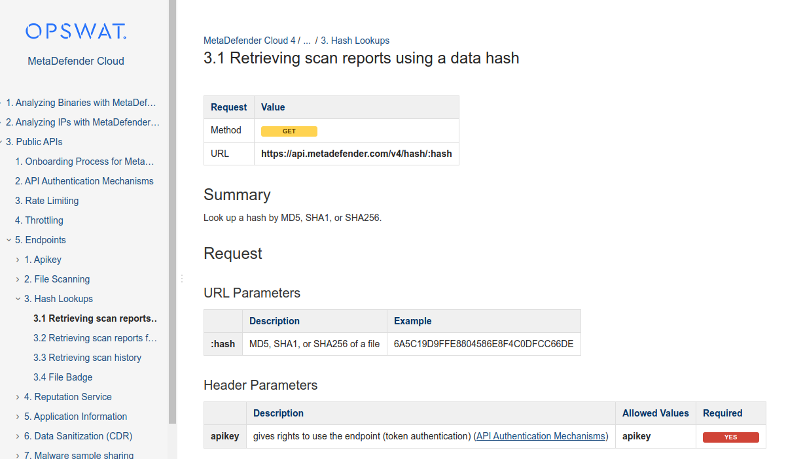
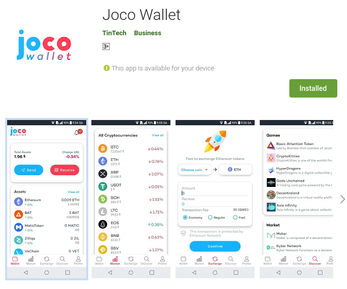
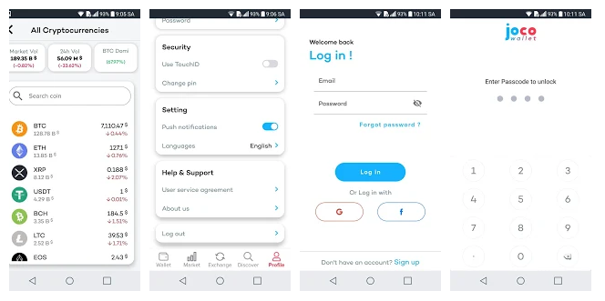

# OPSWAT
## PROJECT: MetaDefender Cloud  
**POSITION**: BACKEND DEVELOPER  
**WEBSITE**: https://metadefender.opswat.com/?lang=en  
**API**: https://onlinehelp.opswat.com/mdcloud/4.html  

A large-scale API system for scanning, building the #1 cloud cybersecurity platform in the world, millions of users, terabytes of data, and 99.99% uptime.

TECHNOLOGIES:
- Nodejs[KoaJS Framework], ,  AWS[EC2, S3, SQS,...] Kafka, Kibana, , Lamda, ElasticSearch,...

- Microservices: Lerna, GRPC, Express HTTP Proxy,  
- Database: MongoDB, PostGreSLQ, RedisDB  
- Tesing: Jasmine, Locus
- Devops: Docker, Kubenetes, Minikube, Python Script, Shell Script,...
- Third party services: Stripe API, Jira API,...

RESPONSIBILITIES:

- Improving and maintain an 80 Restful APIs backend platform written by NodeJs, integrate with multiple 3rd party system and other services: Stripe, Metadefender Core V4, Kafka, Elastic Search, Jira, MongoDB, AWS(S3, SQS,...)  

- Write deploying script for a microservices system, apply and implement a microservices architecture  
- Implement new Gateway service using Express-Gateway  
- Setup and maintain Elasticseach logging system, monitor and maintain a large auto-scalable system.  
- Implementing load testing using Locust.io  
- Improve and maintain a complex worker written by NodeJs  

# STARTUP TINTECH
## PROJECT: ETHEREUM BLOCKCHAIN WALLET 
**POSITION**: FULLSTACK WEB DEVELOPER  
**WEBSITE**: https://wallet.joco.asia/  
**ANDROID**: https://play.google.com/store/apps/details?id=org.tintech.walletaum    

A mobile application used for those who want to manage their ETH cryptocurrency in ETH wallet: send and receive ETH/Token, Perform swap between ETH and token, …

- Backend: Nodejs [Loopback 3x, SailsJs], AWS, Heroku, PostgreSQL, Linux, 
- Frontend:  Javascript, ReactJS, Material UI
- BlockChain platform - APIs Service: Ethereum, Infura, CoinMarketCap, CoinGecko, Ethplorer, …
- DevOps: Docker, Docker Swarm, Linux, AWS, Jenkins, Redis, Kibana, Grafana,...

Key Responsibilities & Achievement: 
- Take responsibility to build from scratch, deliver and maintain bug-free, error-free 50 APIs backend system using Nodejs [Loopback 3x] served for a Mobile Application. 
- Design and develop from scratch a system architecture with 3 servers to meet the project development requirement. 
- Design a MongoDB database model for the whole project and develop API for a user management system with authentication & authorization.
- Apply and handle multiple third parties services with Ethereum Network: Ethereum, CoinGecko, Ethplorer, … Build a server to crawl cryptocurrency data from CoinGecko and save it to the MongoDB database.
- Develop API for all features of a cryptocurrency wallet: create a wallet, store a private key, import user exit wallet, check total balance, manage cryptocurrency inside the wallet, send Ethereum, and token, receive Ethereum and token, check transaction, view market data, … Use web3js library to develop all core API to perform all crypto wallet functions.
- Developing a Customer Service System using React Js/ Redux from scratch helps to manage and support all users.
- Apply logging and monitoring to backend system using Nodejs library Morgan and Appmetrics-dash
- Work closely with the front-end mobile team to develop a system push notification using Firebase Cloud Message.
- Design and deploy the whole project on AWS Cloud and company local server.
