# OPSWAT COMPANY
## PROJECT: MetaDefender Cloud  
**POSITION**: BACKEND DEVELOPER  
**WEBSITE**: https://metadefender.opswat.com/?lang=en  
**API**: https://onlinehelp.opswat.com/mdcloud/4.html  

A large-scale API system for scanning, building the #1 cloud cybersecurity platform in the world, millions of users, terabytes of data, and 99.99% uptime.
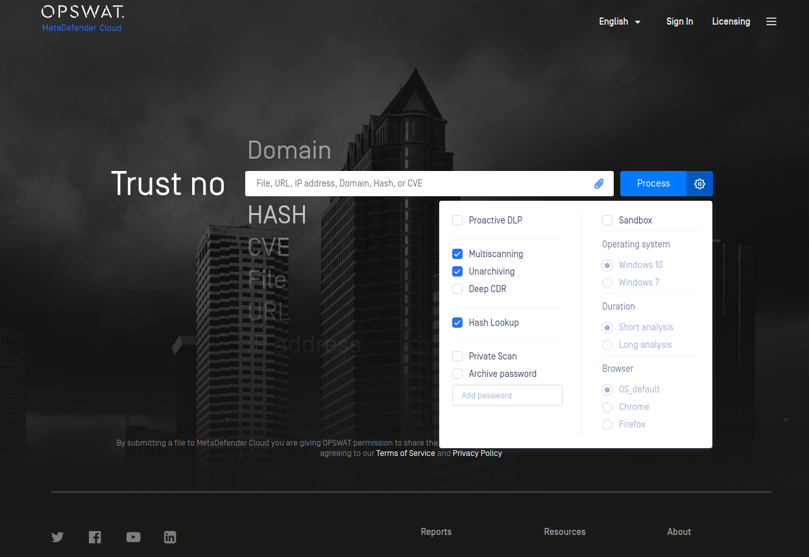

TECHNOLOGIES:
- Nodejs[KoaJS Framework], AWS[EC2, S3, SQS, Lamda...] Kafka, Kibana, ElasticSearch,...
- Microservices: Lerna, GRPC, Express HTTP Proxy, ... 
- Database: MongoDB, PostGreSLQ, RedisDB,...
- Tesing: Jasmine, Locus
- Devops: Docker, Kubenetes, Minikube, Python Script, Shell Script,...
- Third party services: Stripe API, Jira API,...

RESPONSIBILITIES:

- Improving and maintain an 80 Restful APIs backend platform written by NodeJs, integrate with multiple 3rd party system and other services: Stripe, Metadefender Core V4, Kafka, Elastic Search, Jira, MongoDB, AWS(S3, SQS,...)  
- Write deploying script for a microservices system, apply and implement a microservices architecture  
- Implement new Gateway service using Express-Gateway  
- Setup and maintain Elasticseach logging system, monitor and maintain a large auto-scalable system.  
- Implementing load testing using Locust.io  
- Improve and maintain a complex worker written by NodeJs  

# STARTUP TINTECH COMPANY [1/2019 - 12/2019]  
## PROJECT: ETHEREUM BLOCKCHAIN WALLET 
**POSITION**: BACKEND DEVELOPER  
**WEBSITE**: https://wallet.joco.asia/  
**ANDROID**: https://play.google.com/store/apps/details?id=org.tintech.walletaum    

A mobile application used for those who want to manage their ETH cryptocurrency in ETH wallet: send and receive ETH/Token, Perform swap between ETH and token, …

- Backend: Nodejs [Loopback 3x, SailsJs], AWS, Heroku, PostgreSQL, Linux, 
- Frontend:  Javascript, ReactJS, Material UI
- BlockChain platform - APIs Service: Ethereum, Infura, CoinMarketCap, CoinGecko, Ethplorer, …
- DevOps: Docker, Docker Swarm, Linux, AWS, Jenkins, Redis, Kibana, Grafana,...

**Key Responsibilities & Achievement:** 
- Take responsibility to build from scratch, deliver and maintain bug-free, error-free 50 APIs backend system using Nodejs [Loopback 3x] served for a Mobile Application. 
- Design and develop from scratch a system architecture with 3 servers to meet the project development requirement. 
- Design a MongoDB database model for the whole project and develop API for a user management system with authentication & authorization.
- Apply and handle multiple third parties services with Ethereum Network: Ethereum, CoinGecko, Ethplorer, … Build a server to crawl cryptocurrency data from CoinGecko and save it to the MongoDB database.
- Develop API for all features of a cryptocurrency wallet: create a wallet, store a private key, import user exit wallet, check total balance, manage cryptocurrency inside the wallet, send Ethereum, and token, receive Ethereum and token, check transaction, view market data, … Use web3js library to develop all core API to perform all crypto wallet functions.
- Developing a Customer Service System using React Js/ Redux from scratch helps to manage and support all users.
- Apply logging and monitoring to backend system using Nodejs library Morgan and Appmetrics-dash
- Work closely with the front-end mobile team to develop a system push notification using Firebase Cloud Message.
- Design and deploy the whole project on AWS Cloud and company local server.

## PROJECT: JOB CONNECTION SOCIAL NETWORK 
**POSITION**: DEVOPS ENGINEER   
**WEBSITE**: https://joco.asia/  
**ANDROID**: https://play.google.com/store/apps/details?id=vn.tintech.joco   

A mobile application used for those who want to manage their ETH cryptocurrency in ETH wallet: send and receive ETH/Token, Perform swap between ETH and token, …

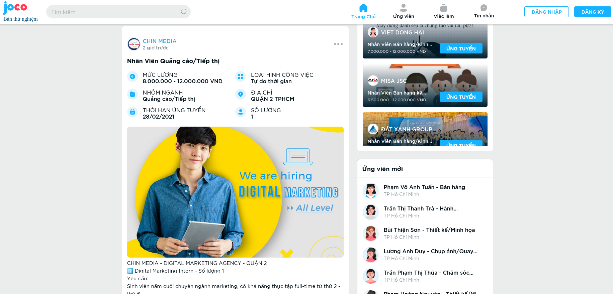
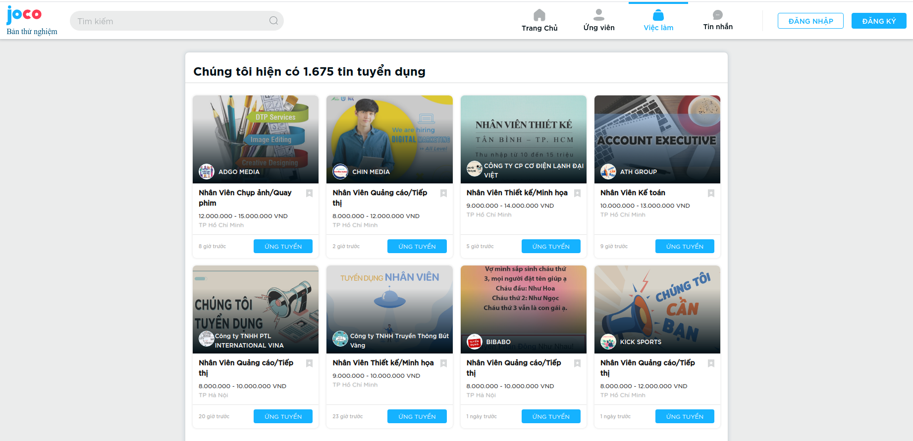
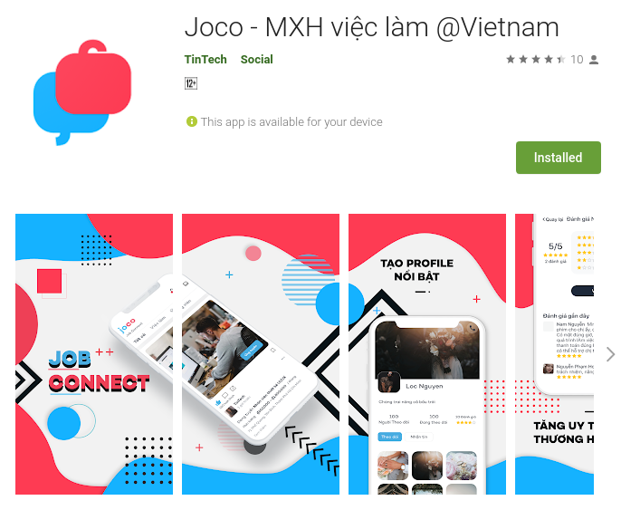

- Backend: PHP[Laravel], Nodejs [Loopback 3x, SailsJs], AWS, Heroku, PostgreSQL, Linux, 
- Frontend:  Javascript, ReactJS, Material UI
- DevOps: Docker, Docker Swarm, Linux, AWS, Jenkins, Redis, Kibana, Grafana,...

**Key Responsibilities & Achievement:**   
DevOps Engineer: 
- Take full responsibility to mainly build and DevOps infrastructure on AWS Cloud to deploy this whole application
- Build a large scalable backend and frontend system using Docker Swarm
- Develop and deliver an ultimate bash script to perform CI/CD for all processes of this large application using GitHub, Jenkins, and bash script.
- Deploy all sub-application on AWS using a lot of Amazon technologies [ECS, EKS, EC2, RDS, S3, SES,... ]
- Build a monitoring system using Prometheus, Grafana, ...  

Backend Developer: 
- Take responsibility to build from scratch, deliver and maintain a backend system to crawl data from many human resource websites 
- Build a database model that represents the business requirement.
- Develop a job server to crawl data automatically every day to make sure you get all the new job information from many different human resource websites.
- Develop a chat backend system for a chat feature of the main mobile application.
- Deploy and maintain an existing backend system with PHP Laravel

## PROJECT: HUMAN RESOURCES CRAWLER TOOL
**POSITION**: FULLSTACK DEVELOPER  
**WEBSITE**: https://cvbox.asia/  

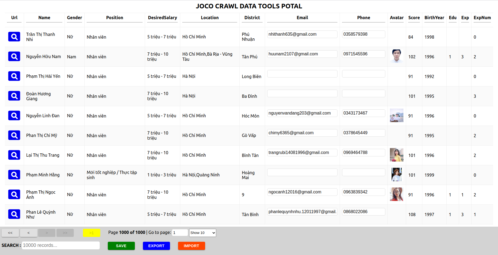

This small tool help you to crawl data( job, candidate, company) from some human resource page in VN( like Mywork, Careerbuilder, Vietnamwork,...) and then save them to MongoDB

It come with a frontend small page help you to update candidate infomation so you can update each data by yourself after crawling.

- Backend: Nodejs [ExpressJS], MongoDB, Linux, 
- Frontend:  Javascript, ReactJS, Material UI…
- DevOps: Docker, Docker Swarm, Linux, AWS, Jenkins, Redis, Kibana, Grafana,...

**Key Responsibilities & Achievement:**   

Backend Developer: 
- Build from scratch a system automatically crawl data( job, candidate, company) from some human resource page in VN( like Mywork, Careerbuilder, Vietnamwork,...) and then save them to MongoDB

# INTEL PRODUCT VIETNAM 				      - [1/2017 - 1/2019]

Intel factories have a large number of production lines, each one has a ton of machines, there is a big database system to track all product information by each machine.   
We are a team of ~20 members across all Intel Factories in the world dedicated to building any web systems visualizing data to serve the requirements of the process engineer of Intel. We help them to analyze and make decisions to improve the process of the production line based on the systems we develop.  

**Technologies:**	
- Backend: Nodejs [ExpressJS, SocketIO], PHP, Python [Pandas], SQL Server, AWS.  
- Frontend: HTML, CSS, Bootstrap, Javascript, JQuery,   
- Data Visualization: AmChart, C3 Chart, HighChart, Table Sorter, PivotMaster, Table Sorter  

## PROJECT: MAINTENANCE AND CONTINUOUS DEVELOPING DATA PORTAL WEBSITE
|            |            |
| ------------- | -------------   |
| 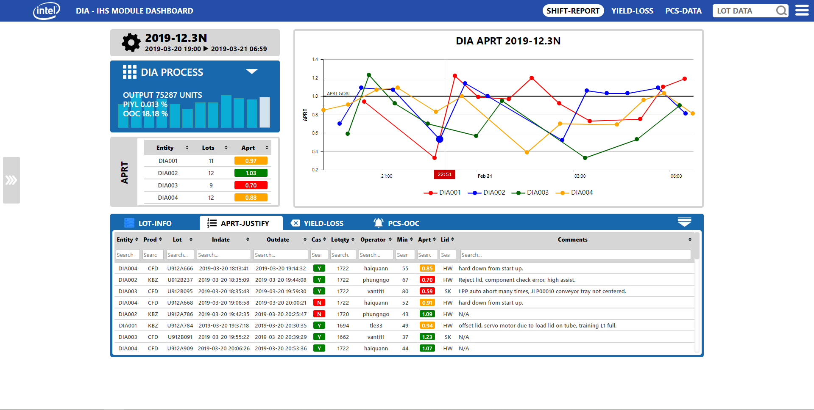       | 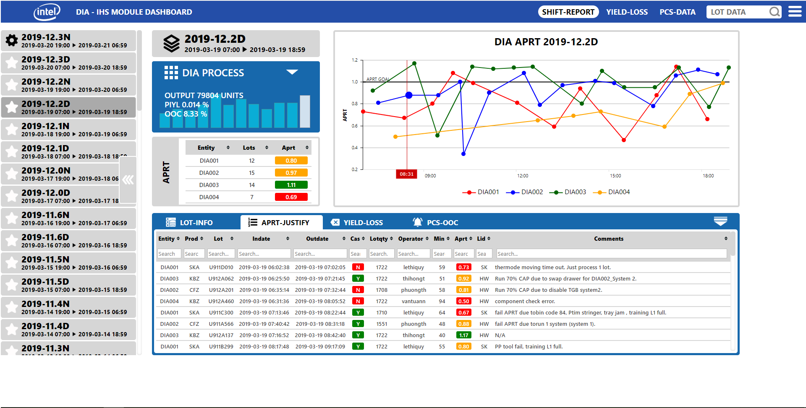 |
| 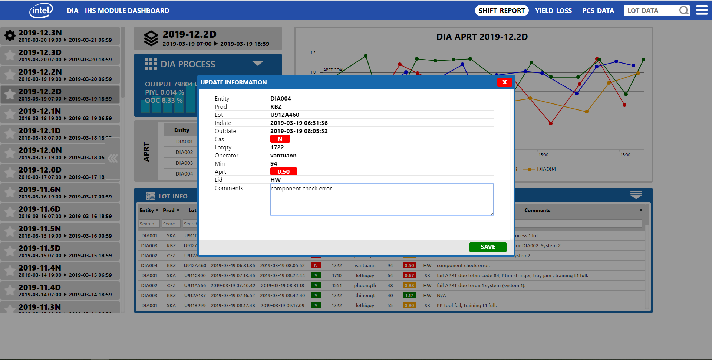       | 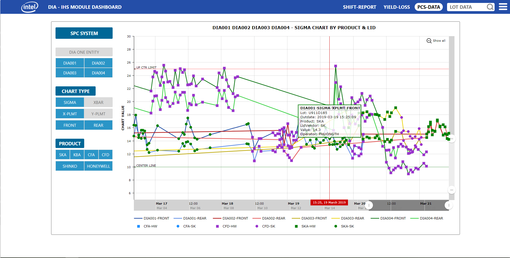 |

**Position:**  Fullstack Web Developer. / Team size: 5 members   
**Key Responsibilities and Achievement:**   
- Achieved 100% reliability and perform maintaining the data portal website to serve over 2200 employees in Intel Vietnam Factory, create 6 new features based on process engineer requirements [collect and visualize data]  
- Develop new PHP backend application in a microservice system to the server a new function on the existing website  
- Edit and optimize frontend Javascript core coding to add more features based on requirements, worked with Jquery, Bootstrap.  
## PROJECT: DATA MANAGEMENT SYSTEM AND CALCULATION WEBSITE
|            |            |
| ------------- | -------------   |
| 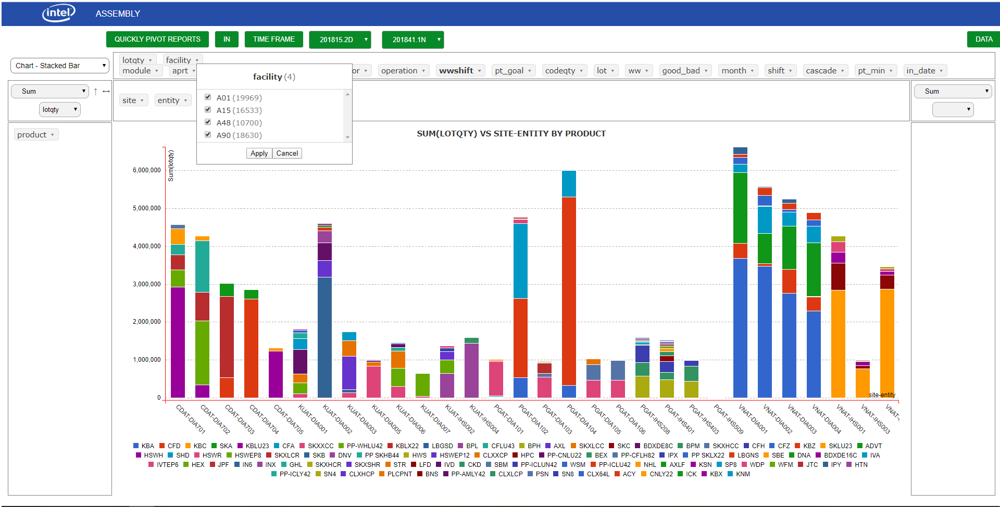       | 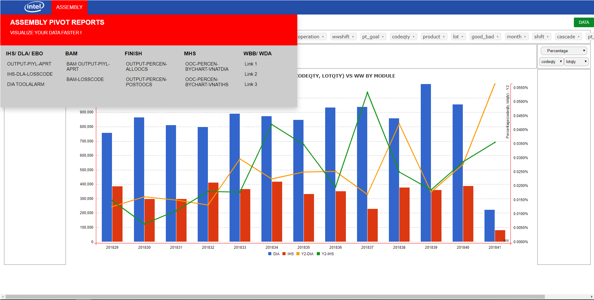 |
| 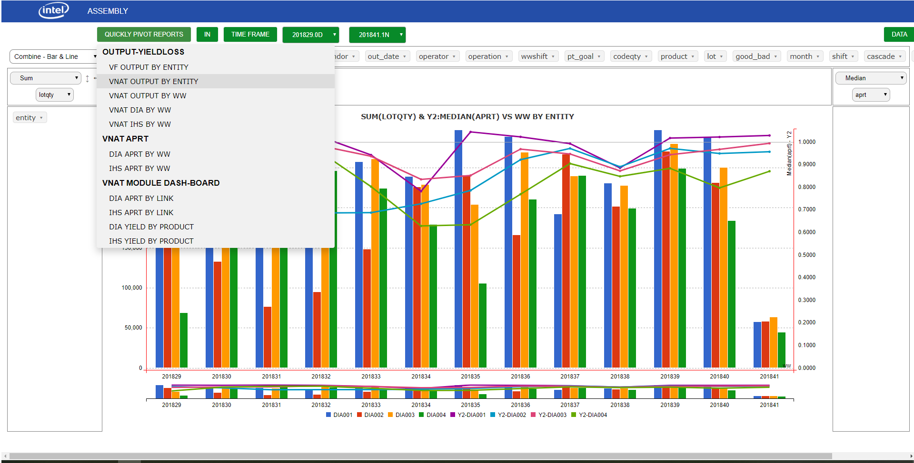       | 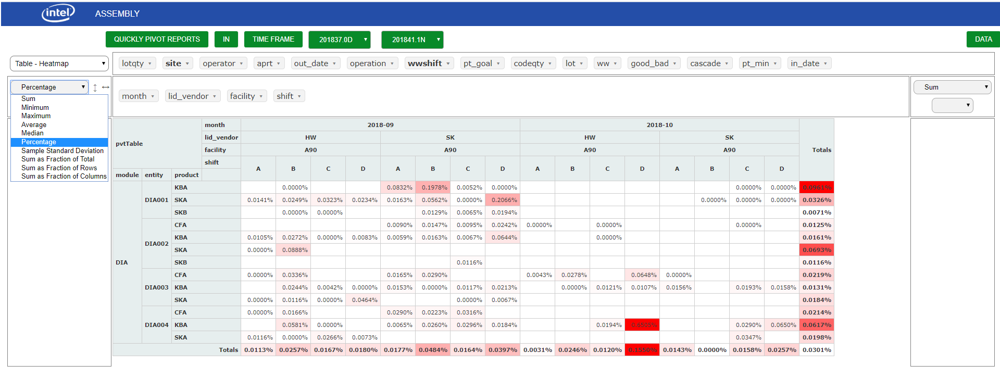 |

**Position:**  Fullstack Web Developer. / Team size: 2 members  
**Key Responsibilities and Achievement:** 
- Build a SQL Server database model to represent the requirements of the project.
- Develop server architecture for the backend system using NodeJs [SocketIO, Express JS]
- Build from scratch and deliver a website for monitoring tool health and important indicator, show data using Javascript data visualization libraries and platform [PivotMaster, AmChart] and framework ReactJS
- Coded python automatically gets data from a log file on 20 machines then performs analysis, then saves it to databases for visualization.
## PROJECT: DATA VISUALIZATION WEB APPLICATION
|            |            |
| ------------- | -------------   |
| 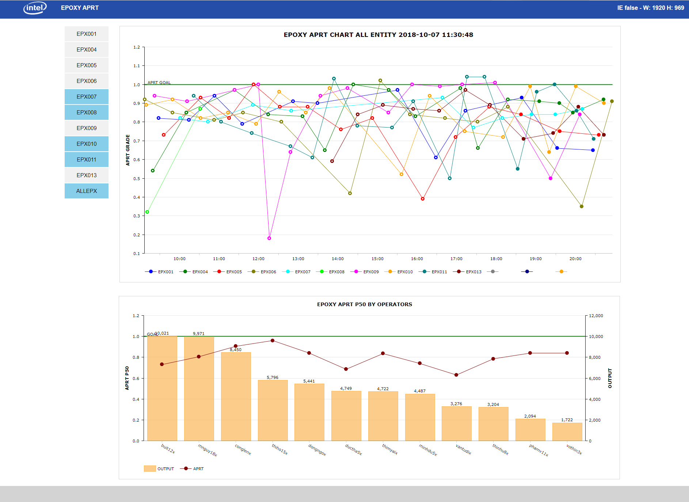       | 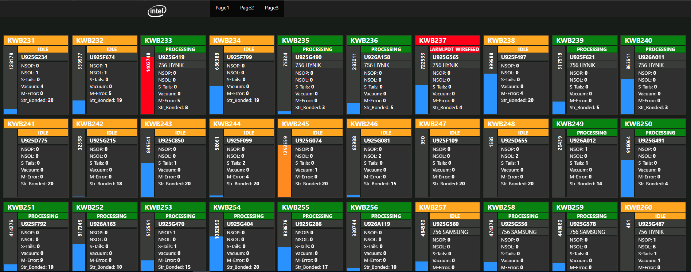 |

**Position:**  Fullstack Web Developer. / Team size: only me.  
**Key Responsibilities and Achievement:**
- Build from scratch a PHP backend system to serve multiple data visualization web application  
- Deliver total 3 data visualization websites for monitoring tool health and important indicator, show data using Javascript data visualization libraries and open sources [PivotMaster, AmChart]  
- Edit and modify open-source library PivotMaster then applied to data visualized web application.  
- Build a Server database synchronize data from >30 machines and deliver a website to help 50 users monitor those data.  
